<!-- markdownlint-capture -->
<!-- markdownlint-disable -->

# Code Metrics

This file is dynamically maintained by a bot, *please do not* edit this by hand. It represents various [code metrics](https://aka.ms/dotnet/code-metrics), such as cyclomatic complexity, maintainability index, and so on.

<div id='myjetwallet-connector-bitgo'></div>

## MyJetWallet.Connector.Bitgo :heavy_check_mark:

The *MyJetWallet.Connector.Bitgo.csproj* project file contains:

- 8 namespaces.
- 26 named types.
- 747 total lines of source code.
- Approximately 260 lines of executable code.
- The highest cyclomatic complexity is 5 :heavy_check_mark:.

<details>
<summary>
  <strong id="myjetwallet-connector-bitgo-rest-models-enums">
    MyJetWallet.Connector.Bitgo.Rest.Models.enums :heavy_check_mark:
  </strong>
</summary>
<br>

The `MyJetWallet.Connector.Bitgo.Rest.Models.enums` namespace contains 2 named types.

- 2 named types.
- 19 total lines of source code.
- Approximately 0 lines of executable code.
- The highest cyclomatic complexity is 0 :heavy_check_mark:.

<details>
<summary>
  <strong id="orderside">
    OrderSide :heavy_check_mark:
  </strong>
</summary>
<br>

- The `OrderSide` contains 2 members.
- 5 total lines of source code.
- Approximately 0 lines of executable code.
- The highest cyclomatic complexity is 0 :heavy_check_mark:.

| Member kind | Line number | Maintainability index | Cyclomatic complexity | Depth of inheritance | Class coupling | Lines of source / executable code |
| :-: | :-: | :-: | :-: | :-: | :-: | :-: |
| Field | <a href='https://github.com/MyJetWallet/MyJetWallet.Connector.Bitgo/blob/master/src/MyJetWallet.Connector.Bitgo/Rest/Models/Enums/OrderSide.cs#L7' title='OrderSide.buy'>7</a> | 100 | 0 :heavy_check_mark: | 0 | 0 | 1 / 0 |
| Field | <a href='https://github.com/MyJetWallet/MyJetWallet.Connector.Bitgo/blob/master/src/MyJetWallet.Connector.Bitgo/Rest/Models/Enums/OrderSide.cs#L8' title='OrderSide.sell'>8</a> | 100 | 0 :heavy_check_mark: | 0 | 0 | 1 / 0 |

<a href="#OrderSide-class-diagram">:link: to `OrderSide` class diagram</a>

<a href="#myjetwallet-connector-bitgo-rest-models-enums">:top: back to MyJetWallet.Connector.Bitgo.Rest.Models.enums</a>

</details>

<details>
<summary>
  <strong id="orderstatus">
    OrderStatus :heavy_check_mark:
  </strong>
</summary>
<br>

- The `OrderStatus` contains 6 members.
- 9 total lines of source code.
- Approximately 0 lines of executable code.
- The highest cyclomatic complexity is 0 :heavy_check_mark:.

| Member kind | Line number | Maintainability index | Cyclomatic complexity | Depth of inheritance | Class coupling | Lines of source / executable code |
| :-: | :-: | :-: | :-: | :-: | :-: | :-: |
| Field | <a href='https://github.com/MyJetWallet/MyJetWallet.Connector.Bitgo/blob/master/src/MyJetWallet.Connector.Bitgo/Rest/Models/Enums/OrderStatus.cs#L9' title='OrderStatus.cancelled'>9</a> | 100 | 0 :heavy_check_mark: | 0 | 0 | 1 / 0 |
| Field | <a href='https://github.com/MyJetWallet/MyJetWallet.Connector.Bitgo/blob/master/src/MyJetWallet.Connector.Bitgo/Rest/Models/Enums/OrderStatus.cs#L7' title='OrderStatus.completed'>7</a> | 100 | 0 :heavy_check_mark: | 0 | 0 | 1 / 0 |
| Field | <a href='https://github.com/MyJetWallet/MyJetWallet.Connector.Bitgo/blob/master/src/MyJetWallet.Connector.Bitgo/Rest/Models/Enums/OrderStatus.cs#L10' title='OrderStatus.error'>10</a> | 100 | 0 :heavy_check_mark: | 0 | 0 | 1 / 0 |
| Field | <a href='https://github.com/MyJetWallet/MyJetWallet.Connector.Bitgo/blob/master/src/MyJetWallet.Connector.Bitgo/Rest/Models/Enums/OrderStatus.cs#L6' title='OrderStatus.open'>6</a> | 100 | 0 :heavy_check_mark: | 0 | 0 | 1 / 0 |
| Field | <a href='https://github.com/MyJetWallet/MyJetWallet.Connector.Bitgo/blob/master/src/MyJetWallet.Connector.Bitgo/Rest/Models/Enums/OrderStatus.cs#L8' title='OrderStatus.pending_cancel'>8</a> | 100 | 0 :heavy_check_mark: | 0 | 0 | 1 / 0 |
| Field | <a href='https://github.com/MyJetWallet/MyJetWallet.Connector.Bitgo/blob/master/src/MyJetWallet.Connector.Bitgo/Rest/Models/Enums/OrderStatus.cs#L5' title='OrderStatus.pending_open'>5</a> | 100 | 0 :heavy_check_mark: | 0 | 0 | 1 / 0 |

<a href="#OrderStatus-class-diagram">:link: to `OrderStatus` class diagram</a>

<a href="#myjetwallet-connector-bitgo-rest-models-enums">:top: back to MyJetWallet.Connector.Bitgo.Rest.Models.enums</a>

</details>

</details>

<details>
<summary>
  <strong id="myjetwallet-connector-bitgo-websocket-models-enums">
    MyJetWallet.Connector.Bitgo.WebSocket.Models.Enums :heavy_check_mark:
  </strong>
</summary>
<br>

The `MyJetWallet.Connector.Bitgo.WebSocket.Models.Enums` namespace contains 2 named types.

- 2 named types.
- 19 total lines of source code.
- Approximately 4 lines of executable code.
- The highest cyclomatic complexity is 0 :heavy_check_mark:.

<details>
<summary>
  <strong id="channel">
    Channel :heavy_check_mark:
  </strong>
</summary>
<br>

- The `Channel` contains 1 members.
- 5 total lines of source code.
- Approximately 2 lines of executable code.
- The highest cyclomatic complexity is 0 :heavy_check_mark:.

| Member kind | Line number | Maintainability index | Cyclomatic complexity | Depth of inheritance | Class coupling | Lines of source / executable code |
| :-: | :-: | :-: | :-: | :-: | :-: | :-: |
| Field | <a href='https://github.com/MyJetWallet/MyJetWallet.Connector.Bitgo/blob/master/src/MyJetWallet.Connector.Bitgo/WebSocket/Models/Enums/Channel.cs#L8' title='Channel.level2'>8</a> | 100 | 0 :heavy_check_mark: | 0 | 0 | 1 / 0 |

<a href="#Channel-class-diagram">:link: to `Channel` class diagram</a>

<a href="#myjetwallet-connector-bitgo-websocket-models-enums">:top: back to MyJetWallet.Connector.Bitgo.WebSocket.Models.Enums</a>

</details>

<details>
<summary>
  <strong id="messagetype">
    MessageType :heavy_check_mark:
  </strong>
</summary>
<br>

- The `MessageType` contains 4 members.
- 8 total lines of source code.
- Approximately 2 lines of executable code.
- The highest cyclomatic complexity is 0 :heavy_check_mark:.

| Member kind | Line number | Maintainability index | Cyclomatic complexity | Depth of inheritance | Class coupling | Lines of source / executable code |
| :-: | :-: | :-: | :-: | :-: | :-: | :-: |
| Field | <a href='https://github.com/MyJetWallet/MyJetWallet.Connector.Bitgo/blob/master/src/MyJetWallet.Connector.Bitgo/WebSocket/Models/Enums/MessageType.cs#L11' title='MessageType.error'>11</a> | 100 | 0 :heavy_check_mark: | 0 | 0 | 1 / 0 |
| Field | <a href='https://github.com/MyJetWallet/MyJetWallet.Connector.Bitgo/blob/master/src/MyJetWallet.Connector.Bitgo/WebSocket/Models/Enums/MessageType.cs#L10' title='MessageType.snapshot'>10</a> | 100 | 0 :heavy_check_mark: | 0 | 0 | 1 / 0 |
| Field | <a href='https://github.com/MyJetWallet/MyJetWallet.Connector.Bitgo/blob/master/src/MyJetWallet.Connector.Bitgo/WebSocket/Models/Enums/MessageType.cs#L8' title='MessageType.subscribe'>8</a> | 100 | 0 :heavy_check_mark: | 0 | 0 | 1 / 0 |
| Field | <a href='https://github.com/MyJetWallet/MyJetWallet.Connector.Bitgo/blob/master/src/MyJetWallet.Connector.Bitgo/WebSocket/Models/Enums/MessageType.cs#L9' title='MessageType.unsubscribe'>9</a> | 100 | 0 :heavy_check_mark: | 0 | 0 | 1 / 0 |

<a href="#MessageType-class-diagram">:link: to `MessageType` class diagram</a>

<a href="#myjetwallet-connector-bitgo-websocket-models-enums">:top: back to MyJetWallet.Connector.Bitgo.WebSocket.Models.Enums</a>

</details>

</details>

<details>
<summary>
  <strong id="myjetwallet-connector-bitgo-rest-models">
    MyJetWallet.Connector.Bitgo.Rest.Models :heavy_check_mark:
  </strong>
</summary>
<br>

The `MyJetWallet.Connector.Bitgo.Rest.Models` namespace contains 12 named types.

- 12 named types.
- 145 total lines of source code.
- Approximately 124 lines of executable code.
- The highest cyclomatic complexity is 2 :heavy_check_mark:.

<details>
<summary>
  <strong id="account">
    Account :heavy_check_mark:
  </strong>
</summary>
<br>

- The `Account` contains 2 members.
- 5 total lines of source code.
- Approximately 4 lines of executable code.
- The highest cyclomatic complexity is 2 :heavy_check_mark:.

| Member kind | Line number | Maintainability index | Cyclomatic complexity | Depth of inheritance | Class coupling | Lines of source / executable code |
| :-: | :-: | :-: | :-: | :-: | :-: | :-: |
| Property | <a href='https://github.com/MyJetWallet/MyJetWallet.Connector.Bitgo/blob/master/src/MyJetWallet.Connector.Bitgo/Rest/Models/Account.cs#L7' title='string Account.Id'>7</a> | 100 | 2 :heavy_check_mark: | 0 | 1 | 1 / 2 |
| Property | <a href='https://github.com/MyJetWallet/MyJetWallet.Connector.Bitgo/blob/master/src/MyJetWallet.Connector.Bitgo/Rest/Models/Account.cs#L8' title='string Account.Name'>8</a> | 100 | 2 :heavy_check_mark: | 0 | 1 | 1 / 2 |

<a href="#Account-class-diagram">:link: to `Account` class diagram</a>

<a href="#myjetwallet-connector-bitgo-rest-models">:top: back to MyJetWallet.Connector.Bitgo.Rest.Models</a>

</details>

<details>
<summary>
  <strong id="bitgoerror">
    BitgoError :heavy_check_mark:
  </strong>
</summary>
<br>

- The `BitgoError` contains 3 members.
- 8 total lines of source code.
- Approximately 6 lines of executable code.
- The highest cyclomatic complexity is 2 :heavy_check_mark:.

| Member kind | Line number | Maintainability index | Cyclomatic complexity | Depth of inheritance | Class coupling | Lines of source / executable code |
| :-: | :-: | :-: | :-: | :-: | :-: | :-: |
| Property | <a href='https://github.com/MyJetWallet/MyJetWallet.Connector.Bitgo/blob/master/src/MyJetWallet.Connector.Bitgo/Rest/Models/BitgoError.cs#L7' title='string BitgoError.Error'>7</a> | 100 | 2 :heavy_check_mark: | 0 | 1 | 1 / 2 |
| Property | <a href='https://github.com/MyJetWallet/MyJetWallet.Connector.Bitgo/blob/master/src/MyJetWallet.Connector.Bitgo/Rest/Models/BitgoError.cs#L9' title='string BitgoError.ErrorName'>9</a> | 100 | 2 :heavy_check_mark: | 0 | 1 | 1 / 2 |
| Property | <a href='https://github.com/MyJetWallet/MyJetWallet.Connector.Bitgo/blob/master/src/MyJetWallet.Connector.Bitgo/Rest/Models/BitgoError.cs#L11' title='string BitgoError.ReqId'>11</a> | 100 | 2 :heavy_check_mark: | 0 | 1 | 1 / 2 |

<a href="#BitgoError-class-diagram">:link: to `BitgoError` class diagram</a>

<a href="#myjetwallet-connector-bitgo-rest-models">:top: back to MyJetWallet.Connector.Bitgo.Rest.Models</a>

</details>

<details>
<summary>
  <strong id="bitgoresultt">
    BitgoResult&lt;T&gt; :heavy_check_mark:
  </strong>
</summary>
<br>

- The `BitgoResult<T>` contains 3 members.
- 6 total lines of source code.
- Approximately 0 lines of executable code.
- The highest cyclomatic complexity is 2 :heavy_check_mark:.

| Member kind | Line number | Maintainability index | Cyclomatic complexity | Depth of inheritance | Class coupling | Lines of source / executable code |
| :-: | :-: | :-: | :-: | :-: | :-: | :-: |
| Property | <a href='https://github.com/MyJetWallet/MyJetWallet.Connector.Bitgo/blob/master/src/MyJetWallet.Connector.Bitgo/Rest/Models/BitgoResult.cs#L7' title='BitgoError BitgoResult<T>.Error'>7</a> | 100 | 2 :heavy_check_mark: | 0 | 1 | 1 / 0 |
| Property | <a href='https://github.com/MyJetWallet/MyJetWallet.Connector.Bitgo/blob/master/src/MyJetWallet.Connector.Bitgo/Rest/Models/BitgoResult.cs#L6' title='T BitgoResult<T>.Result'>6</a> | 100 | 2 :heavy_check_mark: | 0 | 0 | 1 / 0 |
| Property | <a href='https://github.com/MyJetWallet/MyJetWallet.Connector.Bitgo/blob/master/src/MyJetWallet.Connector.Bitgo/Rest/Models/BitgoResult.cs#L5' title='bool BitgoResult<T>.Success'>5</a> | 100 | 2 :heavy_check_mark: | 0 | 0 | 1 / 0 |

<a href="#BitgoResult&lt;T&gt;-class-diagram">:link: to `BitgoResult&lt;T&gt;` class diagram</a>

<a href="#myjetwallet-connector-bitgo-rest-models">:top: back to MyJetWallet.Connector.Bitgo.Rest.Models</a>

</details>

<details>
<summary>
  <strong id="currency">
    Currency :heavy_check_mark:
  </strong>
</summary>
<br>

- The `Currency` contains 3 members.
- 6 total lines of source code.
- Approximately 6 lines of executable code.
- The highest cyclomatic complexity is 2 :heavy_check_mark:.

| Member kind | Line number | Maintainability index | Cyclomatic complexity | Depth of inheritance | Class coupling | Lines of source / executable code |
| :-: | :-: | :-: | :-: | :-: | :-: | :-: |
| Property | <a href='https://github.com/MyJetWallet/MyJetWallet.Connector.Bitgo/blob/master/src/MyJetWallet.Connector.Bitgo/Rest/Models/Currency.cs#L7' title='string Currency.Id'>7</a> | 100 | 2 :heavy_check_mark: | 0 | 1 | 1 / 2 |
| Property | <a href='https://github.com/MyJetWallet/MyJetWallet.Connector.Bitgo/blob/master/src/MyJetWallet.Connector.Bitgo/Rest/Models/Currency.cs#L9' title='string Currency.Name'>9</a> | 100 | 2 :heavy_check_mark: | 0 | 1 | 1 / 2 |
| Property | <a href='https://github.com/MyJetWallet/MyJetWallet.Connector.Bitgo/blob/master/src/MyJetWallet.Connector.Bitgo/Rest/Models/Currency.cs#L8' title='string Currency.Symbol'>8</a> | 100 | 2 :heavy_check_mark: | 0 | 1 | 1 / 2 |

<a href="#Currency-class-diagram">:link: to `Currency` class diagram</a>

<a href="#myjetwallet-connector-bitgo-rest-models">:top: back to MyJetWallet.Connector.Bitgo.Rest.Models</a>

</details>

<details>
<summary>
  <strong id="currencybalance">
    CurrencyBalance :heavy_check_mark:
  </strong>
</summary>
<br>

- The `CurrencyBalance` contains 5 members.
- 12 total lines of source code.
- Approximately 10 lines of executable code.
- The highest cyclomatic complexity is 2 :heavy_check_mark:.

| Member kind | Line number | Maintainability index | Cyclomatic complexity | Depth of inheritance | Class coupling | Lines of source / executable code |
| :-: | :-: | :-: | :-: | :-: | :-: | :-: |
| Property | <a href='https://github.com/MyJetWallet/MyJetWallet.Connector.Bitgo/blob/master/src/MyJetWallet.Connector.Bitgo/Rest/Models/CurrencyBalance.cs#L11' title='string CurrencyBalance.Balance'>11</a> | 100 | 2 :heavy_check_mark: | 0 | 1 | 1 / 2 |
| Property | <a href='https://github.com/MyJetWallet/MyJetWallet.Connector.Bitgo/blob/master/src/MyJetWallet.Connector.Bitgo/Rest/Models/CurrencyBalance.cs#L9' title='string CurrencyBalance.Currency'>9</a> | 100 | 2 :heavy_check_mark: | 0 | 1 | 1 / 2 |
| Property | <a href='https://github.com/MyJetWallet/MyJetWallet.Connector.Bitgo/blob/master/src/MyJetWallet.Connector.Bitgo/Rest/Models/CurrencyBalance.cs#L7' title='string CurrencyBalance.CurrencyId'>7</a> | 100 | 2 :heavy_check_mark: | 0 | 1 | 1 / 2 |
| Property | <a href='https://github.com/MyJetWallet/MyJetWallet.Connector.Bitgo/blob/master/src/MyJetWallet.Connector.Bitgo/Rest/Models/CurrencyBalance.cs#L13' title='string CurrencyBalance.HeldBalance'>13</a> | 100 | 2 :heavy_check_mark: | 0 | 1 | 1 / 2 |
| Property | <a href='https://github.com/MyJetWallet/MyJetWallet.Connector.Bitgo/blob/master/src/MyJetWallet.Connector.Bitgo/Rest/Models/CurrencyBalance.cs#L15' title='string CurrencyBalance.TradableBalance'>15</a> | 100 | 2 :heavy_check_mark: | 0 | 1 | 1 / 2 |

<a href="#CurrencyBalance-class-diagram">:link: to `CurrencyBalance` class diagram</a>

<a href="#myjetwallet-connector-bitgo-rest-models">:top: back to MyJetWallet.Connector.Bitgo.Rest.Models</a>

</details>

<details>
<summary>
  <strong id="datalistt">
    DataList&lt;T&gt; :heavy_check_mark:
  </strong>
</summary>
<br>

- The `DataList<T>` contains 1 members.
- 4 total lines of source code.
- Approximately 2 lines of executable code.
- The highest cyclomatic complexity is 2 :heavy_check_mark:.

| Member kind | Line number | Maintainability index | Cyclomatic complexity | Depth of inheritance | Class coupling | Lines of source / executable code |
| :-: | :-: | :-: | :-: | :-: | :-: | :-: |
| Property | <a href='https://github.com/MyJetWallet/MyJetWallet.Connector.Bitgo/blob/master/src/MyJetWallet.Connector.Bitgo/Rest/Models/DataList.cs#L7' title='T[] DataList<T>.Data'>7</a> | 100 | 2 :heavy_check_mark: | 0 | 1 | 1 / 2 |

<a href="#DataList&lt;T&gt;-class-diagram">:link: to `DataList&lt;T&gt;` class diagram</a>

<a href="#myjetwallet-connector-bitgo-rest-models">:top: back to MyJetWallet.Connector.Bitgo.Rest.Models</a>

</details>

<details>
<summary>
  <strong id="order">
    Order :heavy_check_mark:
  </strong>
</summary>
<br>

- The `Order` contains 17 members.
- 20 total lines of source code.
- Approximately 34 lines of executable code.
- The highest cyclomatic complexity is 2 :heavy_check_mark:.

| Member kind | Line number | Maintainability index | Cyclomatic complexity | Depth of inheritance | Class coupling | Lines of source / executable code |
| :-: | :-: | :-: | :-: | :-: | :-: | :-: |
| Property | <a href='https://github.com/MyJetWallet/MyJetWallet.Connector.Bitgo/blob/master/src/MyJetWallet.Connector.Bitgo/Rest/Models/Order.cs#L9' title='string Order.AccountId'>9</a> | 100 | 2 :heavy_check_mark: | 0 | 1 | 1 / 2 |
| Property | <a href='https://github.com/MyJetWallet/MyJetWallet.Connector.Bitgo/blob/master/src/MyJetWallet.Connector.Bitgo/Rest/Models/Order.cs#L24' title='string Order.AveragePrice'>24</a> | 100 | 2 :heavy_check_mark: | 0 | 1 | 1 / 2 |
| Property | <a href='https://github.com/MyJetWallet/MyJetWallet.Connector.Bitgo/blob/master/src/MyJetWallet.Connector.Bitgo/Rest/Models/Order.cs#L10' title='string Order.ClientOrderId'>10</a> | 100 | 2 :heavy_check_mark: | 0 | 1 | 1 / 2 |
| Property | <a href='https://github.com/MyJetWallet/MyJetWallet.Connector.Bitgo/blob/master/src/MyJetWallet.Connector.Bitgo/Rest/Models/Order.cs#L15' title='string Order.CompletionDate'>15</a> | 100 | 2 :heavy_check_mark: | 0 | 1 | 1 / 2 |
| Property | <a href='https://github.com/MyJetWallet/MyJetWallet.Connector.Bitgo/blob/master/src/MyJetWallet.Connector.Bitgo/Rest/Models/Order.cs#L12' title='string Order.CreationDate'>12</a> | 100 | 2 :heavy_check_mark: | 0 | 1 | 1 / 2 |
| Property | <a href='https://github.com/MyJetWallet/MyJetWallet.Connector.Bitgo/blob/master/src/MyJetWallet.Connector.Bitgo/Rest/Models/Order.cs#L23' title='string Order.FilledQuantity'>23</a> | 100 | 2 :heavy_check_mark: | 0 | 1 | 1 / 2 |
| Property | <a href='https://github.com/MyJetWallet/MyJetWallet.Connector.Bitgo/blob/master/src/MyJetWallet.Connector.Bitgo/Rest/Models/Order.cs#L8' title='string Order.Id'>8</a> | 100 | 2 :heavy_check_mark: | 0 | 1 | 1 / 2 |
| Property | <a href='https://github.com/MyJetWallet/MyJetWallet.Connector.Bitgo/blob/master/src/MyJetWallet.Connector.Bitgo/Rest/Models/Order.cs#L14' title='string Order.LastFillDate'>14</a> | 100 | 2 :heavy_check_mark: | 0 | 1 | 1 / 2 |
| Property | <a href='https://github.com/MyJetWallet/MyJetWallet.Connector.Bitgo/blob/master/src/MyJetWallet.Connector.Bitgo/Rest/Models/Order.cs#L19' title='string Order.Product'>19</a> | 100 | 2 :heavy_check_mark: | 0 | 1 | 1 / 2 |
| Property | <a href='https://github.com/MyJetWallet/MyJetWallet.Connector.Bitgo/blob/master/src/MyJetWallet.Connector.Bitgo/Rest/Models/Order.cs#L21' title='string Order.Quantity'>21</a> | 100 | 2 :heavy_check_mark: | 0 | 1 | 1 / 2 |
| Property | <a href='https://github.com/MyJetWallet/MyJetWallet.Connector.Bitgo/blob/master/src/MyJetWallet.Connector.Bitgo/Rest/Models/Order.cs#L22' title='string Order.QuantityCurrency'>22</a> | 100 | 2 :heavy_check_mark: | 0 | 1 | 1 / 2 |
| Property | <a href='https://github.com/MyJetWallet/MyJetWallet.Connector.Bitgo/blob/master/src/MyJetWallet.Connector.Bitgo/Rest/Models/Order.cs#L13' title='string Order.ScheduledDate'>13</a> | 100 | 2 :heavy_check_mark: | 0 | 1 | 1 / 2 |
| Property | <a href='https://github.com/MyJetWallet/MyJetWallet.Connector.Bitgo/blob/master/src/MyJetWallet.Connector.Bitgo/Rest/Models/Order.cs#L16' title='string Order.SettleDate'>16</a> | 100 | 2 :heavy_check_mark: | 0 | 1 | 1 / 2 |
| Property | <a href='https://github.com/MyJetWallet/MyJetWallet.Connector.Bitgo/blob/master/src/MyJetWallet.Connector.Bitgo/Rest/Models/Order.cs#L20' title='string Order.Side'>20</a> | 100 | 2 :heavy_check_mark: | 0 | 1 | 1 / 2 |
| Property | <a href='https://github.com/MyJetWallet/MyJetWallet.Connector.Bitgo/blob/master/src/MyJetWallet.Connector.Bitgo/Rest/Models/Order.cs#L18' title='string Order.Status'>18</a> | 100 | 2 :heavy_check_mark: | 0 | 1 | 1 / 2 |
| Property | <a href='https://github.com/MyJetWallet/MyJetWallet.Connector.Bitgo/blob/master/src/MyJetWallet.Connector.Bitgo/Rest/Models/Order.cs#L11' title='string Order.Time'>11</a> | 100 | 2 :heavy_check_mark: | 0 | 1 | 1 / 2 |
| Property | <a href='https://github.com/MyJetWallet/MyJetWallet.Connector.Bitgo/blob/master/src/MyJetWallet.Connector.Bitgo/Rest/Models/Order.cs#L17' title='string Order.Type'>17</a> | 100 | 2 :heavy_check_mark: | 0 | 1 | 1 / 2 |

<a href="#Order-class-diagram">:link: to `Order` class diagram</a>

<a href="#myjetwallet-connector-bitgo-rest-models">:top: back to MyJetWallet.Connector.Bitgo.Rest.Models</a>

</details>

<details>
<summary>
  <strong id="orderbooklevel1snapshot">
    OrderBookLevel1Snapshot :heavy_check_mark:
  </strong>
</summary>
<br>

- The `OrderBookLevel1Snapshot` contains 6 members.
- 9 total lines of source code.
- Approximately 12 lines of executable code.
- The highest cyclomatic complexity is 2 :heavy_check_mark:.

| Member kind | Line number | Maintainability index | Cyclomatic complexity | Depth of inheritance | Class coupling | Lines of source / executable code |
| :-: | :-: | :-: | :-: | :-: | :-: | :-: |
| Property | <a href='https://github.com/MyJetWallet/MyJetWallet.Connector.Bitgo/blob/master/src/MyJetWallet.Connector.Bitgo/Rest/Models/OrderBookLevel1Snapshot.cs#L11' title='string OrderBookLevel1Snapshot.AskPrice'>11</a> | 100 | 2 :heavy_check_mark: | 0 | 1 | 1 / 2 |
| Property | <a href='https://github.com/MyJetWallet/MyJetWallet.Connector.Bitgo/blob/master/src/MyJetWallet.Connector.Bitgo/Rest/Models/OrderBookLevel1Snapshot.cs#L12' title='string OrderBookLevel1Snapshot.AskSize'>12</a> | 100 | 2 :heavy_check_mark: | 0 | 1 | 1 / 2 |
| Property | <a href='https://github.com/MyJetWallet/MyJetWallet.Connector.Bitgo/blob/master/src/MyJetWallet.Connector.Bitgo/Rest/Models/OrderBookLevel1Snapshot.cs#L9' title='string OrderBookLevel1Snapshot.BidPrice'>9</a> | 100 | 2 :heavy_check_mark: | 0 | 1 | 1 / 2 |
| Property | <a href='https://github.com/MyJetWallet/MyJetWallet.Connector.Bitgo/blob/master/src/MyJetWallet.Connector.Bitgo/Rest/Models/OrderBookLevel1Snapshot.cs#L10' title='string OrderBookLevel1Snapshot.BidSize'>10</a> | 100 | 2 :heavy_check_mark: | 0 | 1 | 1 / 2 |
| Property | <a href='https://github.com/MyJetWallet/MyJetWallet.Connector.Bitgo/blob/master/src/MyJetWallet.Connector.Bitgo/Rest/Models/OrderBookLevel1Snapshot.cs#L8' title='string OrderBookLevel1Snapshot.Product'>8</a> | 100 | 2 :heavy_check_mark: | 0 | 1 | 1 / 2 |
| Property | <a href='https://github.com/MyJetWallet/MyJetWallet.Connector.Bitgo/blob/master/src/MyJetWallet.Connector.Bitgo/Rest/Models/OrderBookLevel1Snapshot.cs#L7' title='string OrderBookLevel1Snapshot.Time'>7</a> | 100 | 2 :heavy_check_mark: | 0 | 1 | 1 / 2 |

<a href="#OrderBookLevel1Snapshot-class-diagram">:link: to `OrderBookLevel1Snapshot` class diagram</a>

<a href="#myjetwallet-connector-bitgo-rest-models">:top: back to MyJetWallet.Connector.Bitgo.Rest.Models</a>

</details>

<details>
<summary>
  <strong id="orderbooklevel2snapshot">
    OrderBookLevel2Snapshot :heavy_check_mark:
  </strong>
</summary>
<br>

- The `OrderBookLevel2Snapshot` contains 4 members.
- 7 total lines of source code.
- Approximately 8 lines of executable code.
- The highest cyclomatic complexity is 2 :heavy_check_mark:.

| Member kind | Line number | Maintainability index | Cyclomatic complexity | Depth of inheritance | Class coupling | Lines of source / executable code |
| :-: | :-: | :-: | :-: | :-: | :-: | :-: |
| Property | <a href='https://github.com/MyJetWallet/MyJetWallet.Connector.Bitgo/blob/master/src/MyJetWallet.Connector.Bitgo/Rest/Models/OrderBookLevel2Snapshot.cs#L10' title='string[][] OrderBookLevel2Snapshot.Asks'>10</a> | 100 | 2 :heavy_check_mark: | 0 | 1 | 1 / 2 |
| Property | <a href='https://github.com/MyJetWallet/MyJetWallet.Connector.Bitgo/blob/master/src/MyJetWallet.Connector.Bitgo/Rest/Models/OrderBookLevel2Snapshot.cs#L9' title='string[][] OrderBookLevel2Snapshot.Bids'>9</a> | 100 | 2 :heavy_check_mark: | 0 | 1 | 1 / 2 |
| Property | <a href='https://github.com/MyJetWallet/MyJetWallet.Connector.Bitgo/blob/master/src/MyJetWallet.Connector.Bitgo/Rest/Models/OrderBookLevel2Snapshot.cs#L8' title='string OrderBookLevel2Snapshot.Product'>8</a> | 100 | 2 :heavy_check_mark: | 0 | 1 | 1 / 2 |
| Property | <a href='https://github.com/MyJetWallet/MyJetWallet.Connector.Bitgo/blob/master/src/MyJetWallet.Connector.Bitgo/Rest/Models/OrderBookLevel2Snapshot.cs#L7' title='string OrderBookLevel2Snapshot.Time'>7</a> | 100 | 2 :heavy_check_mark: | 0 | 1 | 1 / 2 |

<a href="#OrderBookLevel2Snapshot-class-diagram">:link: to `OrderBookLevel2Snapshot` class diagram</a>

<a href="#myjetwallet-connector-bitgo-rest-models">:top: back to MyJetWallet.Connector.Bitgo.Rest.Models</a>

</details>

<details>
<summary>
  <strong id="product">
    Product :heavy_check_mark:
  </strong>
</summary>
<br>

- The `Product` contains 9 members.
- 12 total lines of source code.
- Approximately 18 lines of executable code.
- The highest cyclomatic complexity is 2 :heavy_check_mark:.

| Member kind | Line number | Maintainability index | Cyclomatic complexity | Depth of inheritance | Class coupling | Lines of source / executable code |
| :-: | :-: | :-: | :-: | :-: | :-: | :-: |
| Property | <a href='https://github.com/MyJetWallet/MyJetWallet.Connector.Bitgo/blob/master/src/MyJetWallet.Connector.Bitgo/Rest/Models/Product.cs#L10' title='string Product.BaseCurrency'>10</a> | 100 | 2 :heavy_check_mark: | 0 | 1 | 1 / 2 |
| Property | <a href='https://github.com/MyJetWallet/MyJetWallet.Connector.Bitgo/blob/master/src/MyJetWallet.Connector.Bitgo/Rest/Models/Product.cs#L9' title='string Product.BaseCurrencyId'>9</a> | 100 | 2 :heavy_check_mark: | 0 | 1 | 1 / 2 |
| Property | <a href='https://github.com/MyJetWallet/MyJetWallet.Connector.Bitgo/blob/master/src/MyJetWallet.Connector.Bitgo/Rest/Models/Product.cs#L13' title='string Product.BaseMinSize'>13</a> | 100 | 2 :heavy_check_mark: | 0 | 1 | 1 / 2 |
| Property | <a href='https://github.com/MyJetWallet/MyJetWallet.Connector.Bitgo/blob/master/src/MyJetWallet.Connector.Bitgo/Rest/Models/Product.cs#L7' title='string Product.Id'>7</a> | 100 | 2 :heavy_check_mark: | 0 | 1 | 1 / 2 |
| Property | <a href='https://github.com/MyJetWallet/MyJetWallet.Connector.Bitgo/blob/master/src/MyJetWallet.Connector.Bitgo/Rest/Models/Product.cs#L8' title='string Product.Name'>8</a> | 100 | 2 :heavy_check_mark: | 0 | 1 | 1 / 2 |
| Property | <a href='https://github.com/MyJetWallet/MyJetWallet.Connector.Bitgo/blob/master/src/MyJetWallet.Connector.Bitgo/Rest/Models/Product.cs#L12' title='string Product.QuoteCurrency'>12</a> | 100 | 2 :heavy_check_mark: | 0 | 1 | 1 / 2 |
| Property | <a href='https://github.com/MyJetWallet/MyJetWallet.Connector.Bitgo/blob/master/src/MyJetWallet.Connector.Bitgo/Rest/Models/Product.cs#L11' title='string Product.QuoteCurrencyId'>11</a> | 100 | 2 :heavy_check_mark: | 0 | 1 | 1 / 2 |
| Property | <a href='https://github.com/MyJetWallet/MyJetWallet.Connector.Bitgo/blob/master/src/MyJetWallet.Connector.Bitgo/Rest/Models/Product.cs#L15' title='string Product.QuoteIncrement'>15</a> | 100 | 2 :heavy_check_mark: | 0 | 1 | 1 / 2 |
| Property | <a href='https://github.com/MyJetWallet/MyJetWallet.Connector.Bitgo/blob/master/src/MyJetWallet.Connector.Bitgo/Rest/Models/Product.cs#L14' title='string Product.QuoteMinSize'>14</a> | 100 | 2 :heavy_check_mark: | 0 | 1 | 1 / 2 |

<a href="#Product-class-diagram">:link: to `Product` class diagram</a>

<a href="#myjetwallet-connector-bitgo-rest-models">:top: back to MyJetWallet.Connector.Bitgo.Rest.Models</a>

</details>

<details>
<summary>
  <strong id="trade">
    Trade :heavy_check_mark:
  </strong>
</summary>
<br>

- The `Trade` contains 8 members.
- 11 total lines of source code.
- Approximately 16 lines of executable code.
- The highest cyclomatic complexity is 2 :heavy_check_mark:.

| Member kind | Line number | Maintainability index | Cyclomatic complexity | Depth of inheritance | Class coupling | Lines of source / executable code |
| :-: | :-: | :-: | :-: | :-: | :-: | :-: |
| Property | <a href='https://github.com/MyJetWallet/MyJetWallet.Connector.Bitgo/blob/master/src/MyJetWallet.Connector.Bitgo/Rest/Models/Trade.cs#L7' title='string Trade.Id'>7</a> | 100 | 2 :heavy_check_mark: | 0 | 1 | 1 / 2 |
| Property | <a href='https://github.com/MyJetWallet/MyJetWallet.Connector.Bitgo/blob/master/src/MyJetWallet.Connector.Bitgo/Rest/Models/Trade.cs#L8' title='string Trade.OrderId'>8</a> | 100 | 2 :heavy_check_mark: | 0 | 1 | 1 / 2 |
| Property | <a href='https://github.com/MyJetWallet/MyJetWallet.Connector.Bitgo/blob/master/src/MyJetWallet.Connector.Bitgo/Rest/Models/Trade.cs#L12' title='string Trade.Price'>12</a> | 100 | 2 :heavy_check_mark: | 0 | 1 | 1 / 2 |
| Property | <a href='https://github.com/MyJetWallet/MyJetWallet.Connector.Bitgo/blob/master/src/MyJetWallet.Connector.Bitgo/Rest/Models/Trade.cs#L10' title='string Trade.Product'>10</a> | 100 | 2 :heavy_check_mark: | 0 | 1 | 1 / 2 |
| Property | <a href='https://github.com/MyJetWallet/MyJetWallet.Connector.Bitgo/blob/master/src/MyJetWallet.Connector.Bitgo/Rest/Models/Trade.cs#L13' title='string Trade.Quantity'>13</a> | 100 | 2 :heavy_check_mark: | 0 | 1 | 1 / 2 |
| Property | <a href='https://github.com/MyJetWallet/MyJetWallet.Connector.Bitgo/blob/master/src/MyJetWallet.Connector.Bitgo/Rest/Models/Trade.cs#L14' title='bool Trade.Settled'>14</a> | 100 | 2 :heavy_check_mark: | 0 | 1 | 1 / 2 |
| Property | <a href='https://github.com/MyJetWallet/MyJetWallet.Connector.Bitgo/blob/master/src/MyJetWallet.Connector.Bitgo/Rest/Models/Trade.cs#L11' title='string Trade.Side'>11</a> | 100 | 2 :heavy_check_mark: | 0 | 1 | 1 / 2 |
| Property | <a href='https://github.com/MyJetWallet/MyJetWallet.Connector.Bitgo/blob/master/src/MyJetWallet.Connector.Bitgo/Rest/Models/Trade.cs#L9' title='string Trade.Time'>9</a> | 100 | 2 :heavy_check_mark: | 0 | 1 | 1 / 2 |

<a href="#Trade-class-diagram">:link: to `Trade` class diagram</a>

<a href="#myjetwallet-connector-bitgo-rest-models">:top: back to MyJetWallet.Connector.Bitgo.Rest.Models</a>

</details>

<details>
<summary>
  <strong id="user">
    User :heavy_check_mark:
  </strong>
</summary>
<br>

- The `User` contains 4 members.
- 10 total lines of source code.
- Approximately 8 lines of executable code.
- The highest cyclomatic complexity is 2 :heavy_check_mark:.

| Member kind | Line number | Maintainability index | Cyclomatic complexity | Depth of inheritance | Class coupling | Lines of source / executable code |
| :-: | :-: | :-: | :-: | :-: | :-: | :-: |
| Property | <a href='https://github.com/MyJetWallet/MyJetWallet.Connector.Bitgo/blob/master/src/MyJetWallet.Connector.Bitgo/Rest/Models/User.cs#L13' title='string User.Email'>13</a> | 100 | 2 :heavy_check_mark: | 0 | 1 | 1 / 2 |
| Property | <a href='https://github.com/MyJetWallet/MyJetWallet.Connector.Bitgo/blob/master/src/MyJetWallet.Connector.Bitgo/Rest/Models/User.cs#L9' title='string User.FirstName'>9</a> | 100 | 2 :heavy_check_mark: | 0 | 1 | 1 / 2 |
| Property | <a href='https://github.com/MyJetWallet/MyJetWallet.Connector.Bitgo/blob/master/src/MyJetWallet.Connector.Bitgo/Rest/Models/User.cs#L7' title='string User.Id'>7</a> | 100 | 2 :heavy_check_mark: | 0 | 1 | 1 / 2 |
| Property | <a href='https://github.com/MyJetWallet/MyJetWallet.Connector.Bitgo/blob/master/src/MyJetWallet.Connector.Bitgo/Rest/Models/User.cs#L11' title='string User.LastName'>11</a> | 100 | 2 :heavy_check_mark: | 0 | 1 | 1 / 2 |

<a href="#User-class-diagram">:link: to `User` class diagram</a>

<a href="#myjetwallet-connector-bitgo-rest-models">:top: back to MyJetWallet.Connector.Bitgo.Rest.Models</a>

</details>

</details>

<details>
<summary>
  <strong id="myjetwallet-connector-bitgo-websocket-models">
    MyJetWallet.Connector.Bitgo.WebSocket.Models :heavy_check_mark:
  </strong>
</summary>
<br>

The `MyJetWallet.Connector.Bitgo.WebSocket.Models` namespace contains 3 named types.

- 3 named types.
- 61 total lines of source code.
- Approximately 12 lines of executable code.
- The highest cyclomatic complexity is 3 :heavy_check_mark:.

<details>
<summary>
  <strong id="bitgoorderbook">
    BitgoOrderBook :heavy_check_mark:
  </strong>
</summary>
<br>

- The `BitgoOrderBook` contains 4 members.
- 22 total lines of source code.
- Approximately 4 lines of executable code.
- The highest cyclomatic complexity is 2 :heavy_check_mark:.

| Member kind | Line number | Maintainability index | Cyclomatic complexity | Depth of inheritance | Class coupling | Lines of source / executable code |
| :-: | :-: | :-: | :-: | :-: | :-: | :-: |
| Property | <a href='https://github.com/MyJetWallet/MyJetWallet.Connector.Bitgo/blob/master/src/MyJetWallet.Connector.Bitgo/WebSocket/Models/BitgoOrderBook.cs#L11' title='string[][] BitgoOrderBook.asks'>11</a> | 100 | 2 :heavy_check_mark: | 0 | 0 | 1 / 0 |
| Property | <a href='https://github.com/MyJetWallet/MyJetWallet.Connector.Bitgo/blob/master/src/MyJetWallet.Connector.Bitgo/WebSocket/Models/BitgoOrderBook.cs#L10' title='string[][] BitgoOrderBook.bids'>10</a> | 100 | 2 :heavy_check_mark: | 0 | 0 | 1 / 0 |
| Method | <a href='https://github.com/MyJetWallet/MyJetWallet.Connector.Bitgo/blob/master/src/MyJetWallet.Connector.Bitgo/WebSocket/Models/BitgoOrderBook.cs#L13' title='BitgoOrderBook BitgoOrderBook.Copy()'>13</a> | 72 | 1 :heavy_check_mark: | 0 | 2 | 15 / 4 |
| Property | <a href='https://github.com/MyJetWallet/MyJetWallet.Connector.Bitgo/blob/master/src/MyJetWallet.Connector.Bitgo/WebSocket/Models/BitgoOrderBook.cs#L9' title='string BitgoOrderBook.product'>9</a> | 100 | 2 :heavy_check_mark: | 0 | 0 | 1 / 0 |

<a href="#BitgoOrderBook-class-diagram">:link: to `BitgoOrderBook` class diagram</a>

<a href="#myjetwallet-connector-bitgo-websocket-models">:top: back to MyJetWallet.Connector.Bitgo.WebSocket.Models</a>

</details>

<details>
<summary>
  <strong id="bitgoorderbookhelper">
    BitgoOrderBookHelper :heavy_check_mark:
  </strong>
</summary>
<br>

- The `BitgoOrderBookHelper` contains 2 members.
- 22 total lines of source code.
- Approximately 6 lines of executable code.
- The highest cyclomatic complexity is 3 :heavy_check_mark:.

| Member kind | Line number | Maintainability index | Cyclomatic complexity | Depth of inheritance | Class coupling | Lines of source / executable code |
| :-: | :-: | :-: | :-: | :-: | :-: | :-: |
| Method | <a href='https://github.com/MyJetWallet/MyJetWallet.Connector.Bitgo/blob/master/src/MyJetWallet.Connector.Bitgo/WebSocket/Models/BitgoOrderBookHelper.cs#L6' title='double? BitgoOrderBookHelper.GetBitgoOrderBookPrice(string?[] array)'>6</a> | 77 | 3 :heavy_check_mark: | 0 | 2 | 9 / 3 |
| Method | <a href='https://github.com/MyJetWallet/MyJetWallet.Connector.Bitgo/blob/master/src/MyJetWallet.Connector.Bitgo/WebSocket/Models/BitgoOrderBookHelper.cs#L16' title='double? BitgoOrderBookHelper.GetBitgoOrderBookVolume(string?[] array)'>16</a> | 77 | 3 :heavy_check_mark: | 0 | 2 | 9 / 3 |

<a href="#BitgoOrderBookHelper-class-diagram">:link: to `BitgoOrderBookHelper` class diagram</a>

<a href="#myjetwallet-connector-bitgo-websocket-models">:top: back to MyJetWallet.Connector.Bitgo.WebSocket.Models</a>

</details>

<details>
<summary>
  <strong id="bitgowsmessage">
    BitgoWsMessage :heavy_check_mark:
  </strong>
</summary>
<br>

- The `BitgoWsMessage` contains 4 members.
- 8 total lines of source code.
- Approximately 2 lines of executable code.
- The highest cyclomatic complexity is 2 :heavy_check_mark:.

| Member kind | Line number | Maintainability index | Cyclomatic complexity | Depth of inheritance | Class coupling | Lines of source / executable code |
| :-: | :-: | :-: | :-: | :-: | :-: | :-: |
| Property | <a href='https://github.com/MyJetWallet/MyJetWallet.Connector.Bitgo/blob/master/src/MyJetWallet.Connector.Bitgo/WebSocket/Models/BitgoWsMessage.cs#L11' title='string BitgoWsMessage.channel'>11</a> | 100 | 2 :heavy_check_mark: | 0 | 0 | 1 / 0 |
| Property | <a href='https://github.com/MyJetWallet/MyJetWallet.Connector.Bitgo/blob/master/src/MyJetWallet.Connector.Bitgo/WebSocket/Models/BitgoWsMessage.cs#L13' title='string BitgoWsMessage.message'>13</a> | 100 | 2 :heavy_check_mark: | 0 | 0 | 1 / 0 |
| Property | <a href='https://github.com/MyJetWallet/MyJetWallet.Connector.Bitgo/blob/master/src/MyJetWallet.Connector.Bitgo/WebSocket/Models/BitgoWsMessage.cs#L12' title='string BitgoWsMessage.time'>12</a> | 100 | 2 :heavy_check_mark: | 0 | 0 | 1 / 0 |
| Property | <a href='https://github.com/MyJetWallet/MyJetWallet.Connector.Bitgo/blob/master/src/MyJetWallet.Connector.Bitgo/WebSocket/Models/BitgoWsMessage.cs#L10' title='string BitgoWsMessage.type'>10</a> | 100 | 2 :heavy_check_mark: | 0 | 0 | 1 / 0 |

<a href="#BitgoWsMessage-class-diagram">:link: to `BitgoWsMessage` class diagram</a>

<a href="#myjetwallet-connector-bitgo-websocket-models">:top: back to MyJetWallet.Connector.Bitgo.WebSocket.Models</a>

</details>

</details>

<details>
<summary>
  <strong id="myjetwallet-connector-bitgo-rest">
    MyJetWallet.Connector.Bitgo.Rest :heavy_check_mark:
  </strong>
</summary>
<br>

The `MyJetWallet.Connector.Bitgo.Rest` namespace contains 3 named types.

- 3 named types.
- 295 total lines of source code.
- Approximately 63 lines of executable code.
- The highest cyclomatic complexity is 3 :heavy_check_mark:.

<details>
<summary>
  <strong id="bitgorestapi">
    BitgoRestApi :heavy_check_mark:
  </strong>
</summary>
<br>

- The `BitgoRestApi` contains 21 members.
- 263 total lines of source code.
- Approximately 58 lines of executable code.
- The highest cyclomatic complexity is 3 :heavy_check_mark:.

| Member kind | Line number | Maintainability index | Cyclomatic complexity | Depth of inheritance | Class coupling | Lines of source / executable code |
| :-: | :-: | :-: | :-: | :-: | :-: | :-: |
| Field | <a href='https://github.com/MyJetWallet/MyJetWallet.Connector.Bitgo/blob/master/src/MyJetWallet.Connector.Bitgo/Rest/BitgoRestApi.cs#L16' title='Client BitgoRestApi._client'>16</a> | 100 | 0 :heavy_check_mark: | 0 | 1 | 1 / 0 |
| Field | <a href='https://github.com/MyJetWallet/MyJetWallet.Connector.Bitgo/blob/master/src/MyJetWallet.Connector.Bitgo/Rest/BitgoRestApi.cs#L18' title='HttpClient BitgoRestApi._httpClient'>18</a> | 100 | 0 :heavy_check_mark: | 0 | 1 | 1 / 0 |
| Field | <a href='https://github.com/MyJetWallet/MyJetWallet.Connector.Bitgo/blob/master/src/MyJetWallet.Connector.Bitgo/Rest/BitgoRestApi.cs#L20' title='long BitgoRestApi._nonce'>20</a> | 100 | 0 :heavy_check_mark: | 0 | 0 | 1 / 0 |
| Method | <a href='https://github.com/MyJetWallet/MyJetWallet.Connector.Bitgo/blob/master/src/MyJetWallet.Connector.Bitgo/Rest/BitgoRestApi.cs#L22' title='BitgoRestApi.BitgoRestApi(Client client)'>22</a> | 83 | 1 :heavy_check_mark: | 0 | 4 | 9 / 2 |
| Method | <a href='https://github.com/MyJetWallet/MyJetWallet.Connector.Bitgo/blob/master/src/MyJetWallet.Connector.Bitgo/Rest/BitgoRestApi.cs#L255' title='Task<BitgoResponse> BitgoRestApi.CallAsync(HttpMethod method, string endpoint, string body = null)'>255</a> | 64 | 2 :heavy_check_mark: | 0 | 8 | 21 / 8 |
| Method | <a href='https://github.com/MyJetWallet/MyJetWallet.Connector.Bitgo/blob/master/src/MyJetWallet.Connector.Bitgo/Rest/BitgoRestApi.cs#L155' title='Task<BitgoResult<string>> BitgoRestApi.CancelOrder(string accountId, string orderId)'>155</a> | 76 | 3 :heavy_check_mark: | 0 | 5 | 11 / 3 |
| Method | <a href='https://github.com/MyJetWallet/MyJetWallet.Connector.Bitgo/blob/master/src/MyJetWallet.Connector.Bitgo/Rest/BitgoRestApi.cs#L58' title='Task<BitgoResult<DataList<CurrencyBalance>>> BitgoRestApi.GetAccountBalance(string accountId)'>58</a> | 76 | 3 :heavy_check_mark: | 0 | 7 | 11 / 3 |
| Method | <a href='https://github.com/MyJetWallet/MyJetWallet.Connector.Bitgo/blob/master/src/MyJetWallet.Connector.Bitgo/Rest/BitgoRestApi.cs#L34' title='Task<BitgoResult<User>> BitgoRestApi.GetCurrentUser()'>34</a> | 76 | 3 :heavy_check_mark: | 0 | 6 | 13 / 3 |
| Method | <a href='https://github.com/MyJetWallet/MyJetWallet.Connector.Bitgo/blob/master/src/MyJetWallet.Connector.Bitgo/Rest/BitgoRestApi.cs#L143' title='Task<BitgoResult<Order>> BitgoRestApi.GetOrder(string accountId, string orderId)'>143</a> | 76 | 3 :heavy_check_mark: | 0 | 6 | 11 / 3 |
| Method | <a href='https://github.com/MyJetWallet/MyJetWallet.Connector.Bitgo/blob/master/src/MyJetWallet.Connector.Bitgo/Rest/BitgoRestApi.cs#L227' title='Task<BitgoResult<OrderBookLevel1Snapshot>> BitgoRestApi.GetOrderBookLevel1(string accountId, string product)'>227</a> | 76 | 3 :heavy_check_mark: | 0 | 6 | 15 / 3 |
| Method | <a href='https://github.com/MyJetWallet/MyJetWallet.Connector.Bitgo/blob/master/src/MyJetWallet.Connector.Bitgo/Rest/BitgoRestApi.cs#L239' title='Task<BitgoResult<OrderBookLevel2Snapshot>> BitgoRestApi.GetOrderBookLevel2(string accountId, string product)'>239</a> | 76 | 3 :heavy_check_mark: | 0 | 6 | 11 / 3 |
| Method | <a href='https://github.com/MyJetWallet/MyJetWallet.Connector.Bitgo/blob/master/src/MyJetWallet.Connector.Bitgo/Rest/BitgoRestApi.cs#L131' title='Task<BitgoResult<DataList<Order>>> BitgoRestApi.GetOrderByExternalId(string accountId, string externalId)'>131</a> | 76 | 3 :heavy_check_mark: | 0 | 7 | 11 / 3 |
| Method | <a href='https://github.com/MyJetWallet/MyJetWallet.Connector.Bitgo/blob/master/src/MyJetWallet.Connector.Bitgo/Rest/BitgoRestApi.cs#L183' title='Task<BitgoResult<Trade>> BitgoRestApi.GetTrade(string accountId, string tradeId)'>183</a> | 76 | 3 :heavy_check_mark: | 0 | 6 | 11 / 3 |
| Method | <a href='https://github.com/MyJetWallet/MyJetWallet.Connector.Bitgo/blob/master/src/MyJetWallet.Connector.Bitgo/Rest/BitgoRestApi.cs#L46' title='Task<BitgoResult<DataList<Account>>> BitgoRestApi.ListAccounts()'>46</a> | 76 | 3 :heavy_check_mark: | 0 | 7 | 11 / 3 |
| Method | <a href='https://github.com/MyJetWallet/MyJetWallet.Connector.Bitgo/blob/master/src/MyJetWallet.Connector.Bitgo/Rest/BitgoRestApi.cs#L199' title='Task<BitgoResult<DataList<Currency>>> BitgoRestApi.ListCurrencies(string accountId)'>199</a> | 76 | 3 :heavy_check_mark: | 0 | 7 | 15 / 3 |
| Method | <a href='https://github.com/MyJetWallet/MyJetWallet.Connector.Bitgo/blob/master/src/MyJetWallet.Connector.Bitgo/Rest/BitgoRestApi.cs#L119' title='Task<BitgoResult<DataList<Order>>> BitgoRestApi.ListOrders(string accountId)'>119</a> | 76 | 3 :heavy_check_mark: | 0 | 7 | 11 / 3 |
| Method | <a href='https://github.com/MyJetWallet/MyJetWallet.Connector.Bitgo/blob/master/src/MyJetWallet.Connector.Bitgo/Rest/BitgoRestApi.cs#L211' title='Task<BitgoResult<DataList<Product>>> BitgoRestApi.ListProducts(string accountId)'>211</a> | 76 | 3 :heavy_check_mark: | 0 | 7 | 11 / 3 |
| Method | <a href='https://github.com/MyJetWallet/MyJetWallet.Connector.Bitgo/blob/master/src/MyJetWallet.Connector.Bitgo/Rest/BitgoRestApi.cs#L171' title='Task<BitgoResult<DataList<Trade>>> BitgoRestApi.ListTrades(string accountId)'>171</a> | 76 | 3 :heavy_check_mark: | 0 | 7 | 15 / 3 |
| Method | <a href='https://github.com/MyJetWallet/MyJetWallet.Connector.Bitgo/blob/master/src/MyJetWallet.Connector.Bitgo/Rest/BitgoRestApi.cs#L74' title='Task<BitgoResult<Order>> BitgoRestApi.PlaceLimitOrder(string accountId, string clientOrderId, string product, OrderSide side, decimal quantity, string quantityCurrency, decimal limitPrice)'>74</a> | 71 | 3 :heavy_check_mark: | 0 | 8 | 26 / 4 |
| Method | <a href='https://github.com/MyJetWallet/MyJetWallet.Connector.Bitgo/blob/master/src/MyJetWallet.Connector.Bitgo/Rest/BitgoRestApi.cs#L97' title='Task<BitgoResult<Order>> BitgoRestApi.PlaceMarketOrder(string accountId, string clientOrderId, string product, OrderSide side, decimal quantity, string quantityCurrency)'>97</a> | 71 | 3 :heavy_check_mark: | 0 | 8 | 21 / 4 |
| Field | <a href='https://github.com/MyJetWallet/MyJetWallet.Connector.Bitgo/blob/master/src/MyJetWallet.Connector.Bitgo/Rest/BitgoRestApi.cs#L14' title='string BitgoRestApi.Url'>14</a> | 93 | 0 :heavy_check_mark: | 0 | 0 | 1 / 1 |

<a href="#BitgoRestApi-class-diagram">:link: to `BitgoRestApi` class diagram</a>

<a href="#myjetwallet-connector-bitgo-rest">:top: back to MyJetWallet.Connector.Bitgo.Rest</a>

</details>

<details>
<summary>
  <strong id="bitgorestapifactory">
    BitgoRestApiFactory :heavy_check_mark:
  </strong>
</summary>
<br>

- The `BitgoRestApiFactory` contains 1 members.
- 10 total lines of source code.
- Approximately 3 lines of executable code.
- The highest cyclomatic complexity is 1 :heavy_check_mark:.

| Member kind | Line number | Maintainability index | Cyclomatic complexity | Depth of inheritance | Class coupling | Lines of source / executable code |
| :-: | :-: | :-: | :-: | :-: | :-: | :-: |
| Method | <a href='https://github.com/MyJetWallet/MyJetWallet.Connector.Bitgo/blob/master/src/MyJetWallet.Connector.Bitgo/Rest/BitgoRestApiFactory.cs#L5' title='BitgoRestApi BitgoRestApiFactory.CreateClient(string apiKey)'>5</a> | 79 | 1 :heavy_check_mark: | 0 | 2 | 7 / 3 |

<a href="#BitgoRestApiFactory-class-diagram">:link: to `BitgoRestApiFactory` class diagram</a>

<a href="#myjetwallet-connector-bitgo-rest">:top: back to MyJetWallet.Connector.Bitgo.Rest</a>

</details>

<details>
<summary>
  <strong id="client">
    Client :heavy_check_mark:
  </strong>
</summary>
<br>

- The `Client` contains 3 members.
- 15 total lines of source code.
- Approximately 2 lines of executable code.
- The highest cyclomatic complexity is 1 :heavy_check_mark:.

| Member kind | Line number | Maintainability index | Cyclomatic complexity | Depth of inheritance | Class coupling | Lines of source / executable code |
| :-: | :-: | :-: | :-: | :-: | :-: | :-: |
| Method | <a href='https://github.com/MyJetWallet/MyJetWallet.Connector.Bitgo/blob/master/src/MyJetWallet.Connector.Bitgo/Rest/Client.cs#L7' title='Client.Client()'>7</a> | 96 | 1 :heavy_check_mark: | 0 | 0 | 4 / 1 |
| Method | <a href='https://github.com/MyJetWallet/MyJetWallet.Connector.Bitgo/blob/master/src/MyJetWallet.Connector.Bitgo/Rest/Client.cs#L12' title='Client.Client(string apiKey)'>12</a> | 96 | 1 :heavy_check_mark: | 0 | 0 | 4 / 1 |
| Property | <a href='https://github.com/MyJetWallet/MyJetWallet.Connector.Bitgo/blob/master/src/MyJetWallet.Connector.Bitgo/Rest/Client.cs#L5' title='string Client.ApiKey'>5</a> | 100 | 1 :heavy_check_mark: | 0 | 0 | 1 / 0 |

<a href="#Client-class-diagram">:link: to `Client` class diagram</a>

<a href="#myjetwallet-connector-bitgo-rest">:top: back to MyJetWallet.Connector.Bitgo.Rest</a>

</details>

</details>

<details>
<summary>
  <strong id="myjetwallet-connector-bitgo-rest-util">
    MyJetWallet.Connector.Bitgo.Rest.Util :heavy_check_mark:
  </strong>
</summary>
<br>

The `MyJetWallet.Connector.Bitgo.Rest.Util` namespace contains 1 named types.

- 1 named types.
- 13 total lines of source code.
- Approximately 2 lines of executable code.
- The highest cyclomatic complexity is 2 :heavy_check_mark:.

<details>
<summary>
  <strong id="bitgoresponse">
    BitgoResponse :heavy_check_mark:
  </strong>
</summary>
<br>

- The `BitgoResponse` contains 3 members.
- 11 total lines of source code.
- Approximately 2 lines of executable code.
- The highest cyclomatic complexity is 2 :heavy_check_mark:.

| Member kind | Line number | Maintainability index | Cyclomatic complexity | Depth of inheritance | Class coupling | Lines of source / executable code |
| :-: | :-: | :-: | :-: | :-: | :-: | :-: |
| Method | <a href='https://github.com/MyJetWallet/MyJetWallet.Connector.Bitgo/blob/master/src/MyJetWallet.Connector.Bitgo/Rest/Util/BitgoResponse.cs#L8' title='BitgoResponse.BitgoResponse(bool success, string body)'>8</a> | 85 | 1 :heavy_check_mark: | 0 | 0 | 5 / 2 |
| Property | <a href='https://github.com/MyJetWallet/MyJetWallet.Connector.Bitgo/blob/master/src/MyJetWallet.Connector.Bitgo/Rest/Util/BitgoResponse.cs#L6' title='string BitgoResponse.body'>6</a> | 100 | 2 :heavy_check_mark: | 0 | 0 | 1 / 0 |
| Property | <a href='https://github.com/MyJetWallet/MyJetWallet.Connector.Bitgo/blob/master/src/MyJetWallet.Connector.Bitgo/Rest/Util/BitgoResponse.cs#L5' title='bool BitgoResponse.Success'>5</a> | 100 | 2 :heavy_check_mark: | 0 | 0 | 1 / 0 |

<a href="#BitgoResponse-class-diagram">:link: to `BitgoResponse` class diagram</a>

<a href="#myjetwallet-connector-bitgo-rest-util">:top: back to MyJetWallet.Connector.Bitgo.Rest.Util</a>

</details>

</details>

<details>
<summary>
  <strong id="myjetwallet-connector-bitgo-websocket">
    MyJetWallet.Connector.Bitgo.WebSocket :heavy_check_mark:
  </strong>
</summary>
<br>

The `MyJetWallet.Connector.Bitgo.WebSocket` namespace contains 2 named types.

- 2 named types.
- 173 total lines of source code.
- Approximately 51 lines of executable code.
- The highest cyclomatic complexity is 5 :heavy_check_mark:.

<details>
<summary>
  <strong id="bitgosenderclientwebsocket">
    BitgoSenderClientWebSocket :heavy_check_mark:
  </strong>
</summary>
<br>

- The `BitgoSenderClientWebSocket` contains 2 members.
- 26 total lines of source code.
- Approximately 6 lines of executable code.
- The highest cyclomatic complexity is 1 :heavy_check_mark:.

| Member kind | Line number | Maintainability index | Cyclomatic complexity | Depth of inheritance | Class coupling | Lines of source / executable code |
| :-: | :-: | :-: | :-: | :-: | :-: | :-: |
| Method | <a href='https://github.com/MyJetWallet/MyJetWallet.Connector.Bitgo/blob/master/src/MyJetWallet.Connector.Bitgo/WebSocket/BitgoSenderClientWebSocket.cs#L15' title='Task BitgoSenderClientWebSocket.SubscribeBitgoChannel(ClientWebSocket webSocket, string accountId, string channel, string productId)'>15</a> | 80 | 1 :heavy_check_mark: | 0 | 5 | 11 / 2 |
| Method | <a href='https://github.com/MyJetWallet/MyJetWallet.Connector.Bitgo/blob/master/src/MyJetWallet.Connector.Bitgo/WebSocket/BitgoSenderClientWebSocket.cs#L26' title='Task BitgoSenderClientWebSocket.UnsubscribeBitgoChannel(ClientWebSocket webSocket, string accountId, string channel, string productId)'>26</a> | 80 | 1 :heavy_check_mark: | 0 | 5 | 11 / 2 |

<a href="#BitgoSenderClientWebSocket-class-diagram">:link: to `BitgoSenderClientWebSocket` class diagram</a>

<a href="#myjetwallet-connector-bitgo-websocket">:top: back to MyJetWallet.Connector.Bitgo.WebSocket</a>

</details>

<details>
<summary>
  <strong id="bitgowsorderbooks">
    BitgoWsOrderBooks :heavy_check_mark:
  </strong>
</summary>
<br>

- The `BitgoWsOrderBooks` contains 20 members.
- 141 total lines of source code.
- Approximately 45 lines of executable code.
- The highest cyclomatic complexity is 5 :heavy_check_mark:.

| Member kind | Line number | Maintainability index | Cyclomatic complexity | Depth of inheritance | Class coupling | Lines of source / executable code |
| :-: | :-: | :-: | :-: | :-: | :-: | :-: |
| Field | <a href='https://github.com/MyJetWallet/MyJetWallet.Connector.Bitgo/blob/master/src/MyJetWallet.Connector.Bitgo/WebSocket/BitgoWsOrderBooks.cs#L27' title='string BitgoWsOrderBooks._account'>27</a> | 100 | 0 :heavy_check_mark: | 0 | 0 | 1 / 0 |
| Field | <a href='https://github.com/MyJetWallet/MyJetWallet.Connector.Bitgo/blob/master/src/MyJetWallet.Connector.Bitgo/WebSocket/BitgoWsOrderBooks.cs#L23' title='Dictionary<string, BitgoOrderBook> BitgoWsOrderBooks._data'>23</a> | 93 | 0 :heavy_check_mark: | 0 | 2 | 1 / 1 |
| Field | <a href='https://github.com/MyJetWallet/MyJetWallet.Connector.Bitgo/blob/master/src/MyJetWallet.Connector.Bitgo/WebSocket/BitgoWsOrderBooks.cs#L19' title='BitgoWebsocketEngine BitgoWsOrderBooks._engine'>19</a> | 100 | 0 :heavy_check_mark: | 0 | 1 | 1 / 0 |
| Field | <a href='https://github.com/MyJetWallet/MyJetWallet.Connector.Bitgo/blob/master/src/MyJetWallet.Connector.Bitgo/WebSocket/BitgoWsOrderBooks.cs#L18' title='ILogger<BitgoWsOrderBooks> BitgoWsOrderBooks._logger'>18</a> | 100 | 0 :heavy_check_mark: | 0 | 1 | 1 / 0 |
| Field | <a href='https://github.com/MyJetWallet/MyJetWallet.Connector.Bitgo/blob/master/src/MyJetWallet.Connector.Bitgo/WebSocket/BitgoWsOrderBooks.cs#L26' title='IReadOnlyCollection<string> BitgoWsOrderBooks._marketList'>26</a> | 100 | 0 :heavy_check_mark: | 0 | 1 | 1 / 0 |
| Field | <a href='https://github.com/MyJetWallet/MyJetWallet.Connector.Bitgo/blob/master/src/MyJetWallet.Connector.Bitgo/WebSocket/BitgoWsOrderBooks.cs#L24' title='object BitgoWsOrderBooks._sync'>24</a> | 93 | 0 :heavy_check_mark: | 0 | 0 | 1 / 1 |
| Method | <a href='https://github.com/MyJetWallet/MyJetWallet.Connector.Bitgo/blob/master/src/MyJetWallet.Connector.Bitgo/WebSocket/BitgoWsOrderBooks.cs#L29' title='BitgoWsOrderBooks.BitgoWsOrderBooks(ILogger<BitgoWsOrderBooks> logger, string authToken, string account, IReadOnlyCollection<string> marketList)'>29</a> | 73 | 1 :heavy_check_mark: | 0 | 4 | 11 / 4 |
| Method | <a href='https://github.com/MyJetWallet/MyJetWallet.Connector.Bitgo/blob/master/src/MyJetWallet.Connector.Bitgo/WebSocket/BitgoWsOrderBooks.cs#L108' title='Task BitgoWsOrderBooks.Connect(ClientWebSocket webSocket)'>108</a> | 76 | 2 :heavy_check_mark: | 0 | 8 | 12 / 4 |
| Method | <a href='https://github.com/MyJetWallet/MyJetWallet.Connector.Bitgo/blob/master/src/MyJetWallet.Connector.Bitgo/WebSocket/BitgoWsOrderBooks.cs#L74' title='void BitgoWsOrderBooks.Dispose()'>74</a> | 93 | 1 :heavy_check_mark: | 0 | 2 | 5 / 2 |
| Method | <a href='https://github.com/MyJetWallet/MyJetWallet.Connector.Bitgo/blob/master/src/MyJetWallet.Connector.Bitgo/WebSocket/BitgoWsOrderBooks.cs#L51' title='BitgoOrderBook BitgoWsOrderBooks.GetOrderBookById(string id)'>51</a> | 77 | 2 :heavy_check_mark: | 0 | 4 | 12 / 4 |
| Method | <a href='https://github.com/MyJetWallet/MyJetWallet.Connector.Bitgo/blob/master/src/MyJetWallet.Connector.Bitgo/WebSocket/BitgoWsOrderBooks.cs#L64' title='List<BitgoOrderBook> BitgoWsOrderBooks.GetOrderBooks()'>64</a> | 82 | 1 :heavy_check_mark: | 0 | 4 | 7 / 3 |
| Method | <a href='https://github.com/MyJetWallet/MyJetWallet.Connector.Bitgo/blob/master/src/MyJetWallet.Connector.Bitgo/WebSocket/BitgoWsOrderBooks.cs#L142' title='Task BitgoWsOrderBooks.OnReceiveUpdates(BitgoOrderBook orderBook)'>142</a> | 75 | 2 :heavy_check_mark: | 0 | 6 | 13 / 4 |
| Method | <a href='https://github.com/MyJetWallet/MyJetWallet.Connector.Bitgo/blob/master/src/MyJetWallet.Connector.Bitgo/WebSocket/BitgoWsOrderBooks.cs#L121' title='Task BitgoWsOrderBooks.Receive(ClientWebSocket webSocket, string msg)'>121</a> | 68 | 5 :heavy_check_mark: | 0 | 8 | 20 / 7 |
| Field | <a href='https://github.com/MyJetWallet/MyJetWallet.Connector.Bitgo/blob/master/src/MyJetWallet.Connector.Bitgo/WebSocket/BitgoWsOrderBooks.cs#L72' title='Func<BitgoOrderBook, Task> BitgoWsOrderBooks.ReceiveUpdates'>72</a> | 100 | 0 :heavy_check_mark: | 0 | 3 | 1 / 0 |
| Method | <a href='https://github.com/MyJetWallet/MyJetWallet.Connector.Bitgo/blob/master/src/MyJetWallet.Connector.Bitgo/WebSocket/BitgoWsOrderBooks.cs#L80' title='Task BitgoWsOrderBooks.Reset(string market)'>80</a> | 75 | 2 :heavy_check_mark: | 0 | 4 | 9 / 4 |
| Method | <a href='https://github.com/MyJetWallet/MyJetWallet.Connector.Bitgo/blob/master/src/MyJetWallet.Connector.Bitgo/WebSocket/BitgoWsOrderBooks.cs#L41' title='void BitgoWsOrderBooks.Start()'>41</a> | 100 | 1 :heavy_check_mark: | 0 | 2 | 4 / 1 |
| Method | <a href='https://github.com/MyJetWallet/MyJetWallet.Connector.Bitgo/blob/master/src/MyJetWallet.Connector.Bitgo/WebSocket/BitgoWsOrderBooks.cs#L46' title='void BitgoWsOrderBooks.Stop()'>46</a> | 100 | 1 :heavy_check_mark: | 0 | 2 | 4 / 1 |
| Method | <a href='https://github.com/MyJetWallet/MyJetWallet.Connector.Bitgo/blob/master/src/MyJetWallet.Connector.Bitgo/WebSocket/BitgoWsOrderBooks.cs#L90' title='Task BitgoWsOrderBooks.Subscribe(string market)'>90</a> | 78 | 2 :heavy_check_mark: | 0 | 4 | 8 / 3 |
| Method | <a href='https://github.com/MyJetWallet/MyJetWallet.Connector.Bitgo/blob/master/src/MyJetWallet.Connector.Bitgo/WebSocket/BitgoWsOrderBooks.cs#L99' title='Task BitgoWsOrderBooks.Unsubscribe(string market)'>99</a> | 78 | 2 :heavy_check_mark: | 0 | 4 | 8 / 3 |
| Property | <a href='https://github.com/MyJetWallet/MyJetWallet.Connector.Bitgo/blob/master/src/MyJetWallet.Connector.Bitgo/WebSocket/BitgoWsOrderBooks.cs#L21' title='string BitgoWsOrderBooks.Url'>21</a> | 100 | 2 :heavy_check_mark: | 0 | 0 | 1 / 1 |

<a href="#BitgoWsOrderBooks-class-diagram">:link: to `BitgoWsOrderBooks` class diagram</a>

<a href="#myjetwallet-connector-bitgo-websocket">:top: back to MyJetWallet.Connector.Bitgo.WebSocket</a>

</details>

</details>

<details>
<summary>
  <strong id="myjetwallet-connector-bitgo-wsengine">
    MyJetWallet.Connector.Bitgo.WsEngine :heavy_check_mark:
  </strong>
</summary>
<br>

The `MyJetWallet.Connector.Bitgo.WsEngine` namespace contains 1 named types.

- 1 named types.
- 22 total lines of source code.
- Approximately 4 lines of executable code.
- The highest cyclomatic complexity is 1 :heavy_check_mark:.

<details>
<summary>
  <strong id="bitgowebsocketengine">
    BitgoWebsocketEngine :heavy_check_mark:
  </strong>
</summary>
<br>

- The `BitgoWebsocketEngine` contains 4 members.
- 19 total lines of source code.
- Approximately 4 lines of executable code.
- The highest cyclomatic complexity is 1 :heavy_check_mark:.

| Member kind | Line number | Maintainability index | Cyclomatic complexity | Depth of inheritance | Class coupling | Lines of source / executable code |
| :-: | :-: | :-: | :-: | :-: | :-: | :-: |
| Field | <a href='https://github.com/MyJetWallet/MyJetWallet.Connector.Bitgo/blob/master/src/MyJetWallet.Connector.Bitgo/WsEngine/BitgoWebsocketEngine.cs#L9' title='string BitgoWebsocketEngine._authToken'>9</a> | 100 | 0 :heavy_check_mark: | 0 | 0 | 1 / 0 |
| Field | <a href='https://github.com/MyJetWallet/MyJetWallet.Connector.Bitgo/blob/master/src/MyJetWallet.Connector.Bitgo/WsEngine/BitgoWebsocketEngine.cs#L10' title='int BitgoWebsocketEngine._keepAliveInterval'>10</a> | 100 | 0 :heavy_check_mark: | 0 | 0 | 1 / 0 |
| Method | <a href='https://github.com/MyJetWallet/MyJetWallet.Connector.Bitgo/blob/master/src/MyJetWallet.Connector.Bitgo/WsEngine/BitgoWebsocketEngine.cs#L12' title='BitgoWebsocketEngine.BitgoWebsocketEngine(string name, string url, string authToken, int pingIntervalMSec, int silenceDisconnectIntervalMSec, ILogger logger)'>12</a> | 82 | 1 :heavy_check_mark: | 0 | 2 | 7 / 2 |
| Method | <a href='https://github.com/MyJetWallet/MyJetWallet.Connector.Bitgo/blob/master/src/MyJetWallet.Connector.Bitgo/WsEngine/BitgoWebsocketEngine.cs#L20' title='void BitgoWebsocketEngine.InitHeaders(ClientWebSocket clientWebSocket)'>20</a> | 85 | 1 :heavy_check_mark: | 0 | 2 | 5 / 2 |

<a href="#BitgoWebsocketEngine-class-diagram">:link: to `BitgoWebsocketEngine` class diagram</a>

<a href="#myjetwallet-connector-bitgo-wsengine">:top: back to MyJetWallet.Connector.Bitgo.WsEngine</a>

</details>

</details>

<a href="#myjetwallet-connector-bitgo">:top: back to MyJetWallet.Connector.Bitgo</a>

<div id='testapp'></div>

## TestApp :heavy_check_mark:

The *TestApp.csproj* project file contains:

- 1 namespaces.
- 1 named types.
- 167 total lines of source code.
- Approximately 91 lines of executable code.
- The highest cyclomatic complexity is 7 :heavy_check_mark:.

<details>
<summary>
  <strong id="testapp">
    TestApp :heavy_check_mark:
  </strong>
</summary>
<br>

The `TestApp` namespace contains 1 named types.

- 1 named types.
- 167 total lines of source code.
- Approximately 91 lines of executable code.
- The highest cyclomatic complexity is 7 :heavy_check_mark:.

<details>
<summary>
  <strong id="program">
    Program :heavy_check_mark:
  </strong>
</summary>
<br>

- The `Program` contains 4 members.
- 164 total lines of source code.
- Approximately 91 lines of executable code.
- The highest cyclomatic complexity is 7 :heavy_check_mark:.

| Member kind | Line number | Maintainability index | Cyclomatic complexity | Depth of inheritance | Class coupling | Lines of source / executable code |
| :-: | :-: | :-: | :-: | :-: | :-: | :-: |
| Method | <a href='https://github.com/MyJetWallet/MyJetWallet.Connector.Bitgo/blob/master/src/TestApp/Program.cs#L12' title='Task Program.Main(string[] args)'>12</a> | 100 | 1 :heavy_check_mark: | 0 | 2 | 7 / 1 |
| Method | <a href='https://github.com/MyJetWallet/MyJetWallet.Connector.Bitgo/blob/master/src/TestApp/Program.cs#L91' title='Task Program.TestRestApi()'>91</a> | 42 | 5 :heavy_check_mark: | 0 | 4 | 82 / 60 |
| Method | <a href='https://github.com/MyJetWallet/MyJetWallet.Connector.Bitgo/blob/master/src/TestApp/Program.cs#L82' title='Task Program.TestRestApiOrder()'>82</a> | 79 | 1 :heavy_check_mark: | 0 | 3 | 8 / 3 |
| Method | <a href='https://github.com/MyJetWallet/MyJetWallet.Connector.Bitgo/blob/master/src/TestApp/Program.cs#L20' title='Task Program.TestWsOrderBook()'>20</a> | 50 | 7 :heavy_check_mark: | 0 | 4 | 61 / 27 |

<a href="#Program-class-diagram">:link: to `Program` class diagram</a>

<a href="#testapp">:top: back to TestApp</a>

</details>

</details>

<a href="#testapp">:top: back to TestApp</a>

## Metric definitions

  - **Maintainability index**: Measures ease of code maintenance. Higher values are better.
  - **Cyclomatic complexity**: Measures the number of branches. Lower values are better.
  - **Depth of inheritance**: Measures length of object inheritance hierarchy. Lower values are better.
  - **Class coupling**: Measures the number of classes that are referenced. Lower values are better.
  - **Lines of source code**: Exact number of lines of source code. Lower values are better.
  - **Lines of executable code**: Approximates the lines of executable code. Lower values are better.

## Mermaid class diagrams

<div id="OrderSide-class-diagram"></div>

##### `OrderSide` class diagram

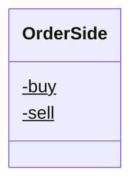

<div id="OrderStatus-class-diagram"></div>

##### `OrderStatus` class diagram

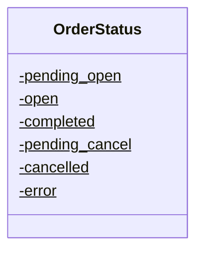

<div id="Channel-class-diagram"></div>

##### `Channel` class diagram

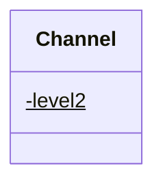

<div id="MessageType-class-diagram"></div>

##### `MessageType` class diagram

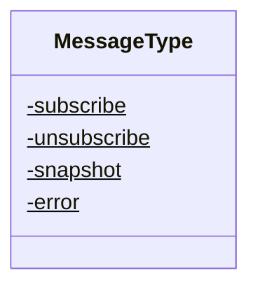

<div id="Account-class-diagram"></div>

##### `Account` class diagram

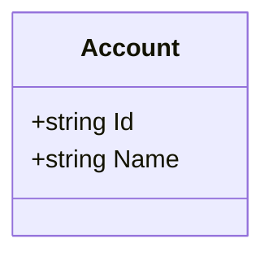

<div id="BitgoError-class-diagram"></div>

##### `BitgoError` class diagram

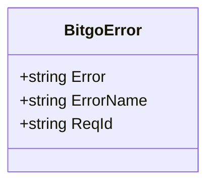

<div id="BitgoResult&lt;T&gt;-class-diagram"></div>

##### `BitgoResult<T>` class diagram

```mermaid
classDiagram
class BitgoResult<T>{
    +bool Success
    +T Result
    +BitgoError Error
}

```

<div id="Currency-class-diagram"></div>

##### `Currency` class diagram

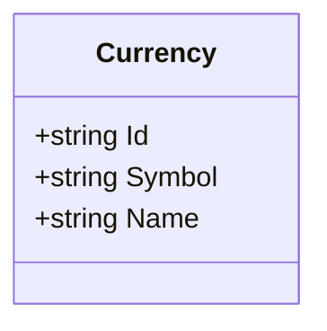

<div id="CurrencyBalance-class-diagram"></div>

##### `CurrencyBalance` class diagram

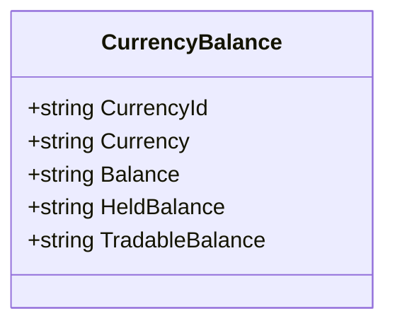

<div id="DataList&lt;T&gt;-class-diagram"></div>

##### `DataList<T>` class diagram

```mermaid
classDiagram
class DataList<T>{
    +T[] Data
}

```

<div id="Order-class-diagram"></div>

##### `Order` class diagram

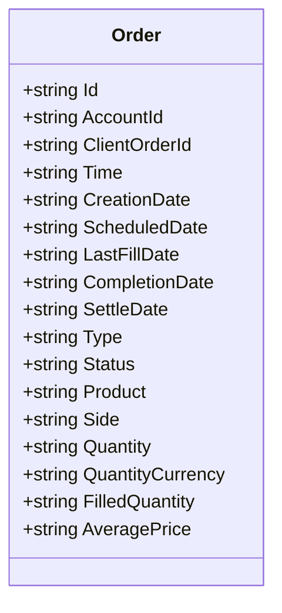

<div id="OrderBookLevel1Snapshot-class-diagram"></div>

##### `OrderBookLevel1Snapshot` class diagram

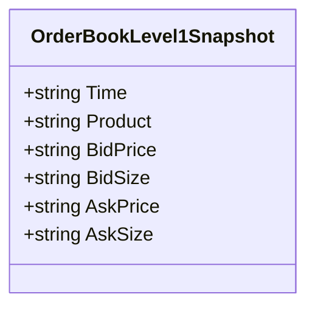

<div id="OrderBookLevel2Snapshot-class-diagram"></div>

##### `OrderBookLevel2Snapshot` class diagram

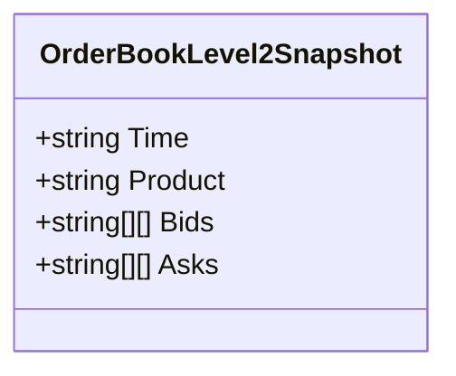

<div id="Product-class-diagram"></div>

##### `Product` class diagram

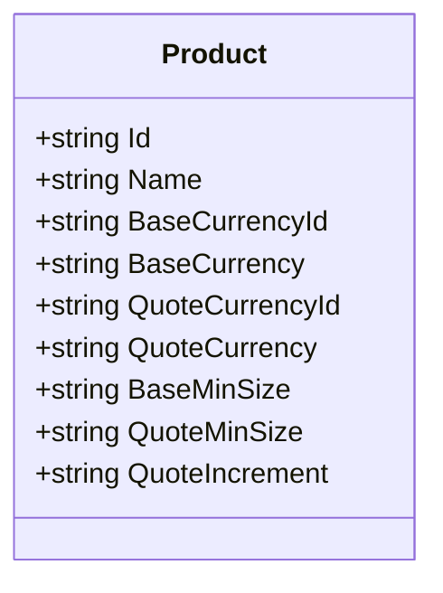

<div id="Trade-class-diagram"></div>

##### `Trade` class diagram

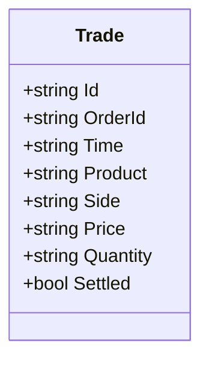

<div id="User-class-diagram"></div>

##### `User` class diagram

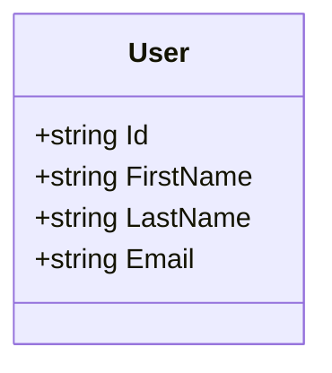

<div id="BitgoOrderBook-class-diagram"></div>

##### `BitgoOrderBook` class diagram

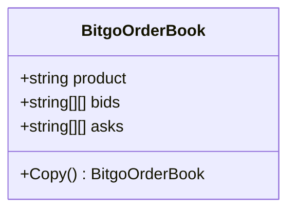

<div id="BitgoOrderBookHelper-class-diagram"></div>

##### `BitgoOrderBookHelper` class diagram

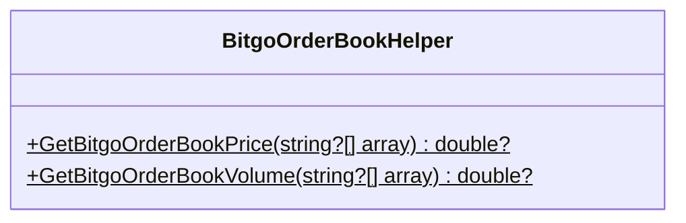

<div id="BitgoWsMessage-class-diagram"></div>

##### `BitgoWsMessage` class diagram

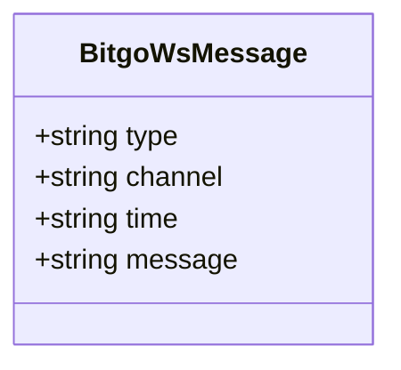

<div id="BitgoRestApi-class-diagram"></div>

##### `BitgoRestApi` class diagram

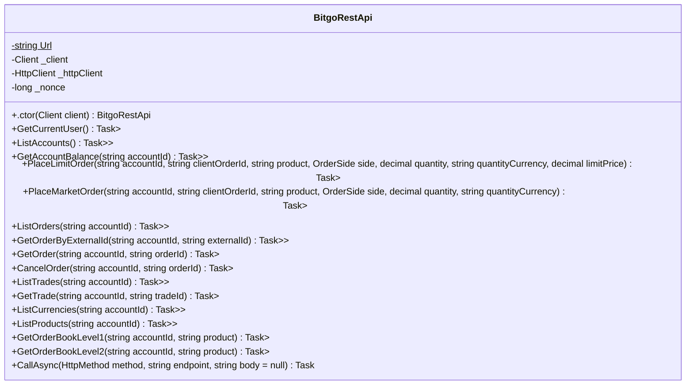

<div id="BitgoRestApiFactory-class-diagram"></div>

##### `BitgoRestApiFactory` class diagram

```mermaid
classDiagram
class BitgoRestApiFactory{
    +CreateClient(string apiKey)$ BitgoRestApi
}

```

<div id="Client-class-diagram"></div>

##### `Client` class diagram

```mermaid
classDiagram
class Client{
    +string ApiKey
    +.ctor() Client
    +.ctor(string apiKey) Client
}

```

<div id="BitgoResponse-class-diagram"></div>

##### `BitgoResponse` class diagram

```mermaid
classDiagram
class BitgoResponse{
    +bool Success
    +string body
    +.ctor(bool success, string body) BitgoResponse
}

```

<div id="BitgoSenderClientWebSocket-class-diagram"></div>

##### `BitgoSenderClientWebSocket` class diagram

```mermaid
classDiagram
class BitgoSenderClientWebSocket{
    +SubscribeBitgoChannel(ClientWebSocket webSocket, string accountId, string channel, string productId)$ Task
    +UnsubscribeBitgoChannel(ClientWebSocket webSocket, string accountId, string channel, string productId)$ Task
}

```

<div id="BitgoWsOrderBooks-class-diagram"></div>

##### `BitgoWsOrderBooks` class diagram

```mermaid
classDiagram
class BitgoWsOrderBooks{
    -ILogger<BitgoWsOrderBooks> _logger
    -BitgoWebsocketEngine _engine
    -Dictionary<string, BitgoOrderBook> _data
    -object _sync
    -IReadOnlyCollection<string> _marketList
    -string _account
    -Func<BitgoOrderBook, Task> ReceiveUpdates
    +string Url$
    +.ctor(ILogger<BitgoWsOrderBooks> logger, string authToken, string account, IReadOnlyCollection<string> marketList) BitgoWsOrderBooks
    +Start() void
    +Stop() void
    +GetOrderBookById(string id) BitgoOrderBook
    +GetOrderBooks() List<BitgoOrderBook>
    +Dispose() void
    +Reset(string market) Task
    +Subscribe(string market) Task
    +Unsubscribe(string market) Task
    +Connect(ClientWebSocket webSocket) Task
    +Receive(ClientWebSocket webSocket, string msg) Task
    +OnReceiveUpdates(BitgoOrderBook orderBook) Task
}

```

<div id="BitgoWebsocketEngine-class-diagram"></div>

##### `BitgoWebsocketEngine` class diagram

```mermaid
classDiagram
class BitgoWebsocketEngine{
    -string _authToken
    -int _keepAliveInterval
    +.ctor(string name, string url, string authToken, int pingIntervalMSec, int silenceDisconnectIntervalMSec, ILogger logger) BitgoWebsocketEngine
    +InitHeaders(ClientWebSocket clientWebSocket) void
}

```

<div id="Program-class-diagram"></div>

##### `Program` class diagram

```mermaid
classDiagram
class Program{
    +Main(string[] args)$ Task
    +TestWsOrderBook()$ Task
    +TestRestApiOrder()$ Task
    +TestRestApi()$ Task
}

```

*This file is maintained by a bot.*

<!-- markdownlint-restore -->
